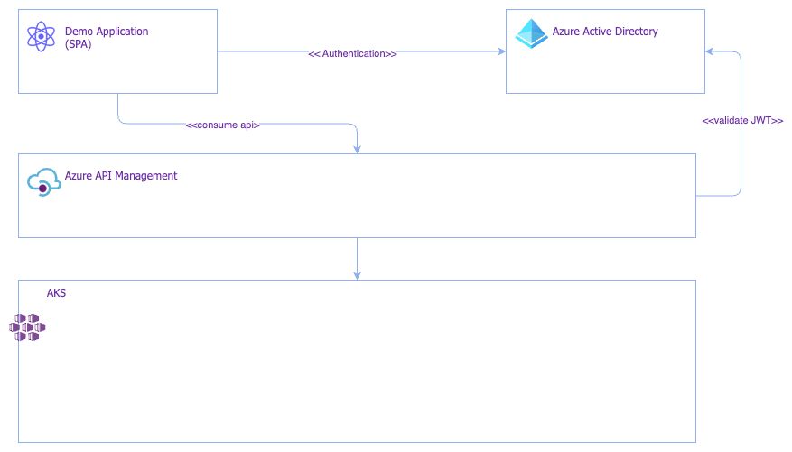
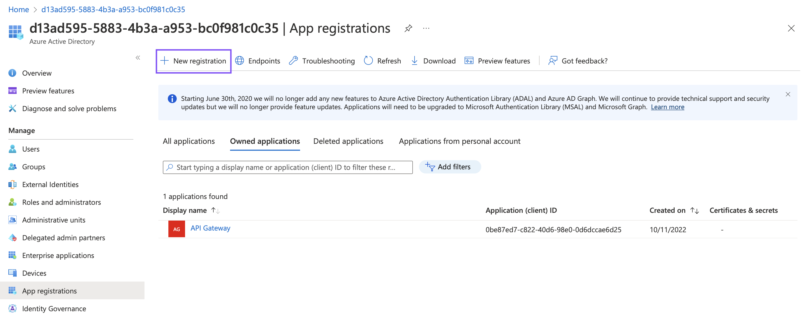
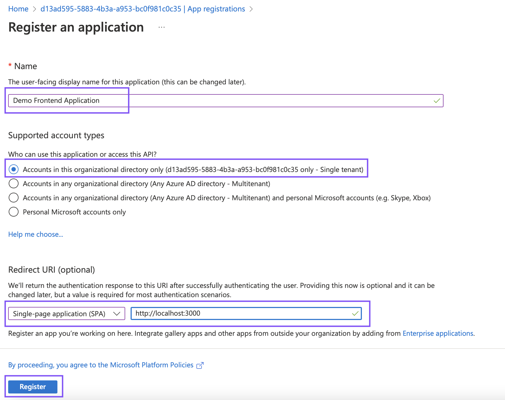
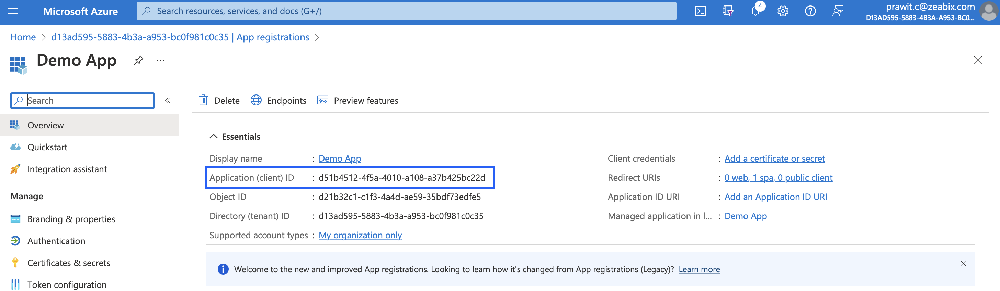
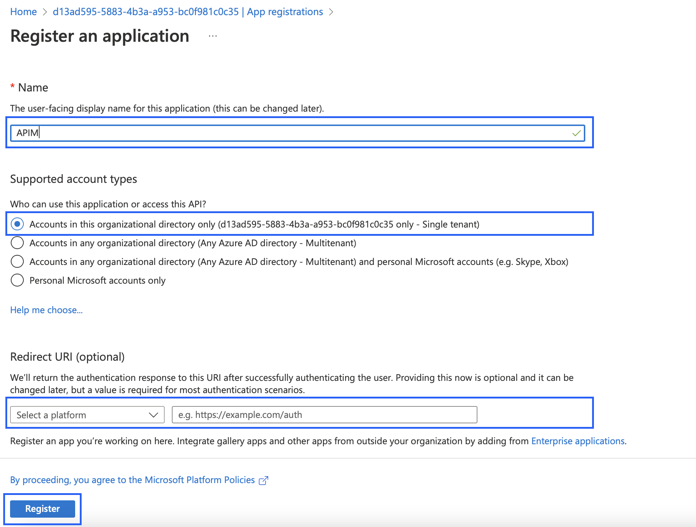
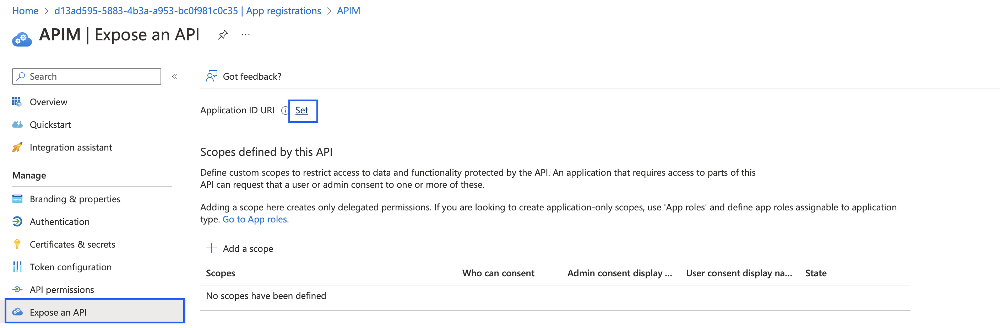
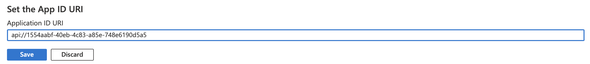
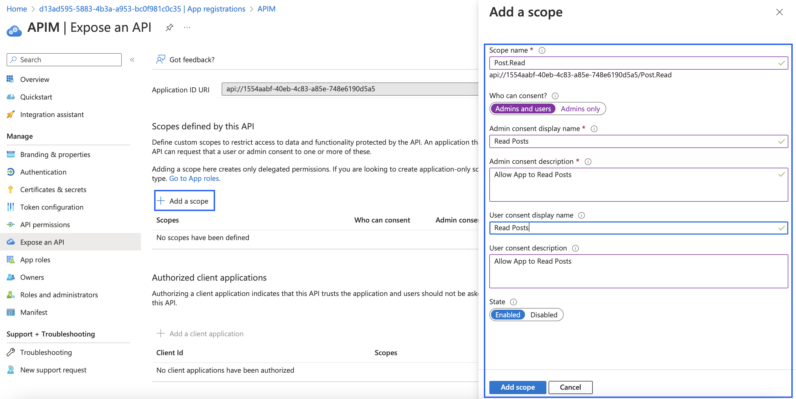
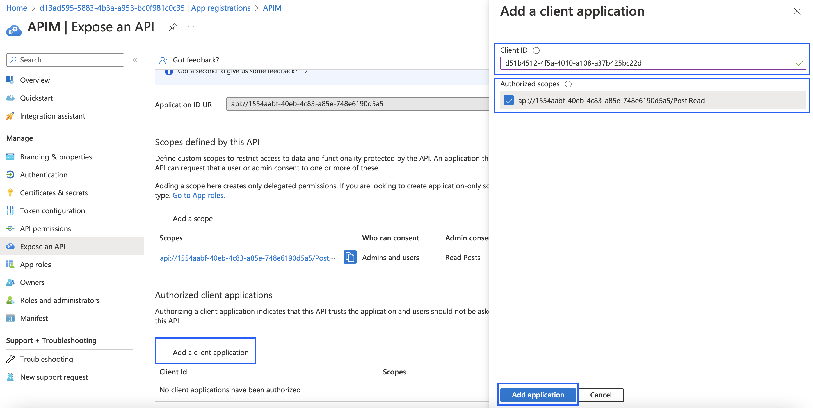

# Azure API Management - OAuth2.0

## Introduction

Azure API Management support OAuth2.0 protocol to protect the data plane (API) with Azure Active Directory (AAD). In this tutorial we will discuss how to protect API using AAD as OAuth2.0 IDP (issuers)

**Architecture**



<br/>

The high level architecture for this exercise, it contains a demo application (frontend) which is also provided in this repository. It was developed using ReactJS as a SPA (Single Page Application). This demo application will perform authentication with Azure Active Directory and then acquired tokens. Then the token will be passed to APIM to call APIs.

APIM will have to validate the token with Azure Active Directory to see if the token is valid or not. The token itself is a signed token. APIM will use PKI mechanism to validate the token using public keys from Azure Active Directory.

<br/>

## Azure Active Directory
The first step is to register app and configure AAD to issue the token to client application.
Regarding the architecure, we need to register 2 applications to AAD. First is the demo application and another one is APIM

<br/>

**Register Demo Application**

1. Login to Azure Portal and navigate to Azure Active Directory
2. On the dashboard you will see the `Tenant ID`, please copy this value which will be used in the later step


3. Click `App registrations` 
4. Click `New registrations`



5. Fill the information and then click `Register`
- Name: Any value to indicate your client app, e.g `Demo App`
- Account type: Select single tanent
- Redirect URL: SPA with `http://localhost:3000`



6. Once the new application is registered, copy the `Application (Client) ID` for next step




<br/>
<br/>

**Register APIM**

Next we will register another application for APIM, 
1. Repeat the previous step, but leave the `Redirect URL` as default



2. Click `Register` then copy the `Application (Client) ID` for use as a configuration for APIM later
3. On the menu, click `Expose API`, then click `Set` Application ID URL



4. The default value should be automaticall populated in the format `api://<app-id>`, Then click `Save`



5. Click `+ Add Scope`, then fill the `Add a scope` information on the right hand side plane



- Scope Name: **Post.Read**
- Who can consent: **Admins and users**
- Admin consent display name: **Read Posts**
- Admin consent description: **Allow App to Read Posts**
- Admin consent display name: **Read Posts**
- Admin consent description: **Allow App to Read Posts**
- State: **Enabled**

Then click `Add Scope`

*NOTE: After scope is added, ensure that you copy the scope name which will be used in configuration later, or you can always go back to this page to copy it later*

6. Click `+ Add a client application` then fill the information on the right hand side plane



- Client ID: **Use Appplication (Client) ID from Demo App**
- Authorized scope: **Checked**

<br/>

## Test login to AAD with demo app

In this tutorial the demo app is also provided for login to AAD and inspect the tokens that issued by AAD, which later we will use this token to send to APIM when we make a request to API

1. Open terminal and nagivate and ensure that you are in the root of this repository
2. Run `npm install`
3. Open `src/authConfig.js` and replace some values with your Application (Client) ID and Tanent ID that you acquired previously

```js
    auth: {
      clientId: "<Application (Client) ID>",
      authority: "https://login.microsoftonline.com/<Tanent ID>", // This is a URL (e.g. https://login.microsoftonline.com/{your tenant ID})
      redirectUri: "http://localhost:3000",
    },

```

4. In the same file (`src/authConfig.js`), Configure the scope 
```js
  export const loginRequest = {
   scopes: ["openid", "api://<APIM App ID>/Post.Read"]
   // Example: 
   // scopes: ["openid", "api://0be87ed7-c822-40d6-98e0-0d6dccae6d25/Post.Read"]
  };
```
5. Run `npm run start`, it should start the React App which can be access with any browser on `http://localhost:3000`

6. Once you open `http://localhost:3000`, Click `Azure Login` on the top-right corner button

7. Login with Azure Account
8. Examine the tokens that the AAD return

<br/>
<br/>


## Configure Azure API Management to validate the token from AAD
After we have successfull login and get the jwt token from AAD by the client application. Now we have to pass this token to APIM when we call the API. These following step is to configure APIM to validate the token with AAD

1. Login to Azure Portal and navigate to Azure API Management then select your instance
2. Click menu `APIs`, select API that you want to protect (individually or you can select All APIs), then in the `Inbound Processing` click `Add Policy`
3. Select `Validate JWT`
4. Enter the required information for JWT token validate process
- **Validate by:** _Header_
- **Header name:** _Authorization_
- **Required Expiration Time:** _Yes_
- **Required Signed Token:** _Yes_
- **Require Scheme:** _Bearer_
- **Audiences:** _api://\<APIM APPID>/_ For example: api://1554aabf-40eb-4c83-a85e-748e6190d5a5
- **Issuers:** _https://sts.windows.net/\<TanentID>/_ For example: https://sts.windows.net/d13ad595-5883-4b3a-a953-bc0f981c0c35/
- **Open ID URLs:** https://login.microsoftonline.com/\<TanentID>/v2.0/.well-known/openid-configuration

<br/>

## Testing protected API

### Unauthorized requests
We have completed configured the APIM to protect API using OAuth 2.0 which will validate JWT token with AAD, let test to see what happen if we invoke API without a valid token

1. Test without JWT Token, Open terminal (or any API client tools) and try to call API without supplying the JWT

```sh
# Example
$ curl -XGET https://poc-apim-ananda.azure-api.net/api/profiles/
``` 

You should see the result with error

```json
{
  "statusCode": 401,
  "message": "JWT not present."
}

```

2. Test with invalid JWT Token, Open terminal (or any API client tools) and try to call API with invalid JWT token (You can copy the valid token from Demo App and then change last couple characters)

```sh
$ TOKEN=eyJ0eXAiOiJKV1QiLCJhbGciOiJSUzI1NiIsImtpZCI6IjJaUXBKM1VwYmpBWVhZR2FYRUpsOGxWMFRPSSJ9.eyJhdWQiOiIwYmU4N2VkNy1jODIyLTQwZDYtOThlMC0wZDZkY2NhZTZkMjUiLCJpc3MiOiJodHRwczovL2xvZ2luLm1pY3Jvc29mdG9ubGluZS5jb20vZDEzYWQ1OTUtNTg4My00YjNhLWE5NTMtYmMwZjk4MWMwYzM1L3YyLjAiLCJpYXQiOjE2NjU0ODUwMTAsIm5iZiI6MTY2NTQ4NTAxMCwiZXhwIjoxNjY1NDg4OTEwLCJhaW8iOiJBZFFBSy84VEFBQUFkalc5ZkhqS0tEdHZ1SmlZMStKcWFhVk02UUd0aEZPS01mcDhDaWYwNTB2Vytqa2s0dHNaa1JGMXNtZng5OWJNeXhnaUdldUYyYVRmNGIxblowdTV3ZXVITVU0WEo4MGswVjhad0lOVlVCK2lOMStnRy9wN2UzRWVxcER1aFFvdFBnRFlVZXl0Y05Ma0k1RlVuNkFpL09EUlNwWGVjTVZhcXo0Z3pJdzl5ek42dHBsZmVNNG9oZ2hycGJLMjQyNm5hTVpNRjhtQWsvYnhsVGZLdEJKakh5aUJSLytPQVlmSnFBSmxxcDNBK2hDcndTYkNOWjNZcmhTUzN2UGNTb085bUNNZHpHNS9TZGsxNmNoUC9UVDgzZz09IiwiaWRwIjoiaHR0cHM6Ly9hY2NvdW50cy5nb29nbGUuY29tL28vc2FtbDI_aWRwaWQ9QzAxcHBybzlyXHUwMDNjZDEzYWQ1OTUtNTg4My00YjNhLWE5NTMtYmMwZjk4MWMwYzM1XHUwMDNlIiwibmFtZSI6InB1aS16ZWFiaXgiLCJub25jZSI6IjE0ZDdjNWY4LTAzNGUtNDA4Zi1hODNkLTM3NTBiOGJkZDFhYyIsIm9pZCI6IjcyMzkyMTFkLTM5ZTAtNDBhYS1iNmY5LTQ3ZTQ4MDA4OGE4NyIsInByZWZlcnJlZF91c2VybmFtZSI6InByYXdpdC5jQHplYWJpeC5jb20iLCJyaCI6IjAuQVVvQWxkVTYwWU5ZT2t1cFU3d1BtQndNTmRkLTZBc2l5TlpBbU9BTmJjeXViU1dKQUx3LiIsInN1YiI6IkpVZ0pYa2hmVm5rc0dKZVhRanE3WlNfaXlYdC1vbEwxOU1wMkY4ZGRYRUUiLCJ0aWQiOiJkMTNhZDU5NS01ODgzLTRiM2EtYTk1My1iYzBmOTgxYzBjMzUiLCJ1dGkiOiJaQVJMUjBrMEowMkVnMlphZVZVZUFBIiwidmVyIjoiMi4wIn0.Yo4TaT1LtGi2ic9fLUNGkWGdF-7QPR8DHuZwo_xTNGO63-CbfKada-GWQOCU2aYwv1XZD883Y9wd4Elt9Y0cqpoMYWHnfFpCEdem1Sw2sN3H_37-JMfKiSZKHgSraFVmxcT0ro4Q1j-ZGVcAGmQJFxTw8whux-m7YQUnBKEpRIKPfQ_C5iT7hv7P38xqNIvKHGpUcjEgp_HcEKV-GL0ZJbhqOxMUjVJsNbxB3NKnCRR7kaELStoizAhURvv4bH-_7GdG7WCEwC_37ipQiGYzw0joPXOSH0kTlA8oW_q2ElAT_zDJlynp8NWkPFAJGWdSphA21on5vbA4w2dInvalidToken

$ curl -XGET https://poc-apim-ananda.azure-api.net/api/profiles/ -H "Authorization: Bearer $TOKEN"
```

You should see response with error messsage

```json
{
  "statusCode": 401,
  "message": "Invalid JWT."
}
```

3. Test with valid JWT, Perform the test like #2 but this time provide the correct JWT that we get from Demo App when we perform azure login. This time you should see the successful response with some data (depends on your backend APIs)

